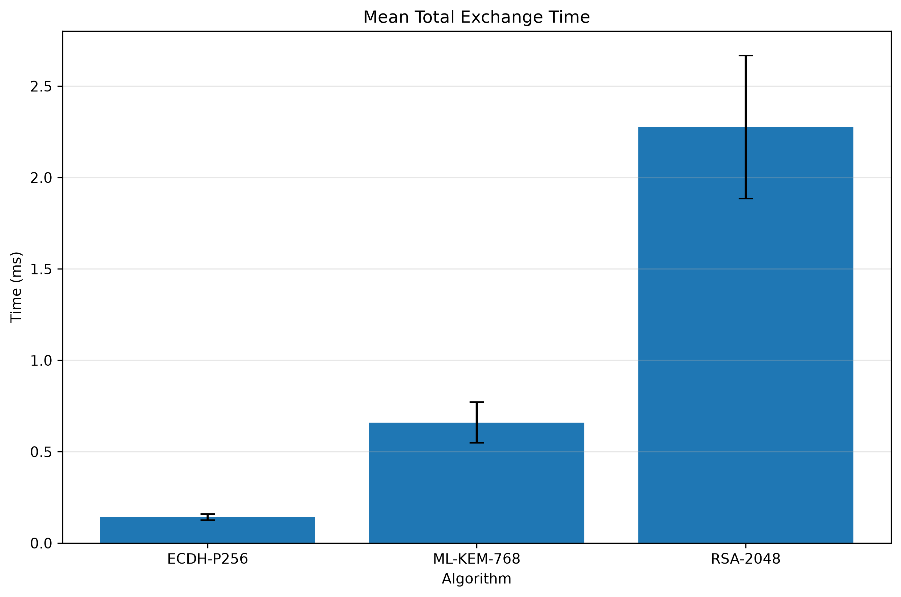
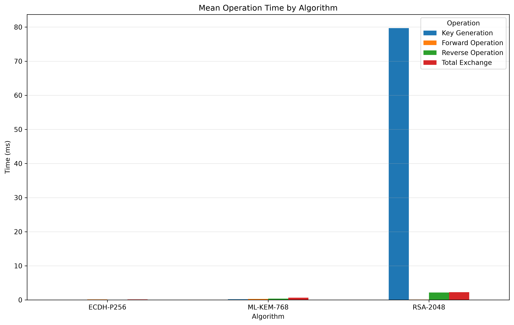
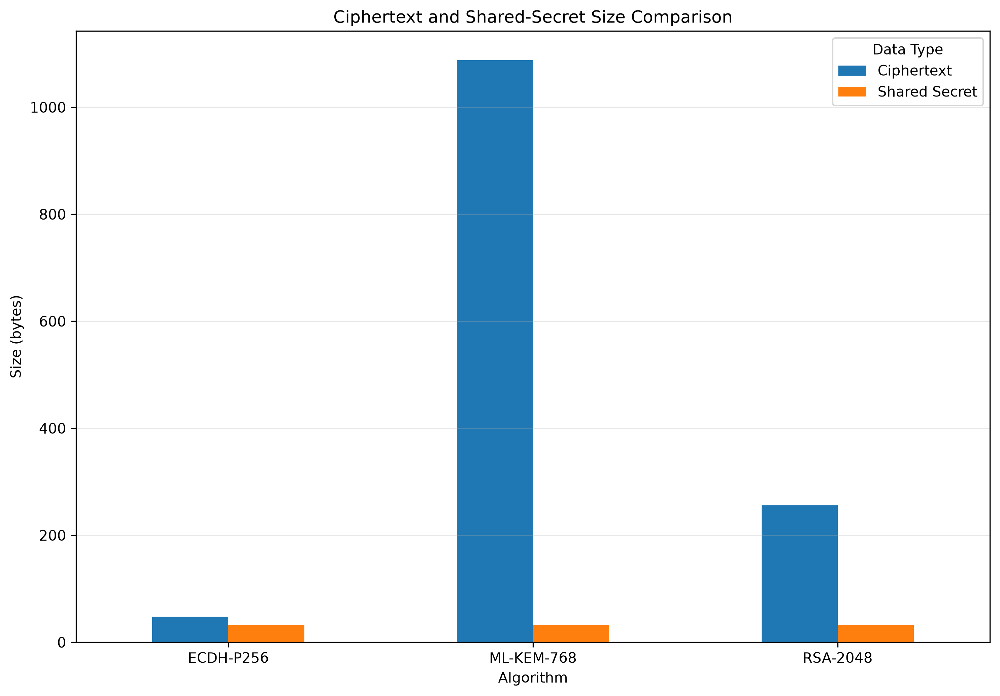

# Post-Quantum Cryptography Benchmark Framework

A modular benchmarking framework for evaluating, comparing, and visualizing classical and post-quantum key establishment algorithms using a consistent experimental methodology.

Currently implemented algorithms include:

- ML-KEM-768 (Post-Quantum Cryptography)
- RSA-2048 (Classical Public-Key Cryptography)
- ECDH-P256 (Elliptic Curve Cryptography)

The framework automatically benchmarks each algorithm, validates results, exports CSV datasets, and generates comparative performance visualizations.

---

## Highlights

- Modular benchmarking framework
- Three integrated cryptographic algorithms
- Automated statistical analysis
- Automatic comparative graph generation
- Reproducible benchmarking methodology

---

## Project Goals

- Benchmark classical and post-quantum key establishment algorithms
- Compare ML-KEM-768, RSA-2048, and ECDH-P256
- Measure execution time
- Measure key and ciphertext sizes
- Produce reproducible benchmark datasets
- Automatically generate comparative visualizations

---

## Technologies

- Python 3.12
- ML-KEM (FIPS 203)
- mlkem Python library
- pandas
- matplotlib
- NumPy

---

## Implemented Algorithms

| Algorithm | Category | Status |
|-----------|----------|:------:|
| ML-KEM-768 | Post-Quantum | ✅ |
| RSA-2048 | Classical | ✅ |
| ECDH-P256 | Classical (ECC) | ✅ |

---

## Repository Structure

```
post-quantum-cryptography/

├── docs/
│   └── benchmark_methodology.md
│
├── results/
│   ├── combined_summary.csv
│   ├── ml_kem_768_summary.csv
│   ├── rsa_2048_summary.csv
│   ├── ecdh_p256_summary.csv
│   └── plots/
│
├── src/
│   ├── algorithms.py
│   ├── benchmark.py
│   ├── benchmark_types.py
│   ├── config.py
│   ├── graphs.py
│   ├── mlkem_demo.py
│   ├── rsa_demo.py
│   ├── ecdh_demo.py
│   └── validation.py
│
├── README.md
└── requirements.txt
```

---

## Features 

- Modular algorithm registration system
- Automated benchmarking framework
- Consistent methodology across all algorithms
- Statistical analysis (mean, median, standard deviation, minimum, maximum)
- CSV export for reproducibility
- Automatic graph generation
- Comparative visualization between classical and post-quantum algorithms
- Benchmark validation layer

---

## Installation

```bash
git clone <repository-url>
cd post-quantum-cryptography
```

Create a virtual environment:

```bash
python -m venv .venv
```

Activate it:

macOS/Linux

```bash
source .venv/bin/activate
```

Install dependencies:

```bash
pip install -r requirements.txt
```

---

## Running the Benchmark

```bash
python src/benchmark.py
```

The benchmark generates:

- Raw benchmark data
- Statistical summaries
- Combined benchmark summary

inside the `results/` directory.

---

## Example Output

```
=== Benchmarking ML-KEM-768 ===

Running 50 warm-up iterations...
Running 1000 measured iterations...

=== Benchmarking RSA-2048 ===

Running 50 warm-up iterations...
Running 1000 measured iterations...

=== Benchmarking ECDH-P256 ===

Running 50 warm-up iterations...
Running 1000 measured iterations...

All benchmarks completed successfully.
Combined summary created:
results/combined_summary.csv
```

---

## Generating Graphs

```bash
python src/graphs.py
```

The generated plots are saved to:

```
results/plots/
```

---

## Benchmark Capabilities

Implemented features:

- ML-KEM-768 benchmarking
- RSA-2048 benchmarking
- ECDH-P256 benchmarking
- Statistical analysis
- Automatic CSV export
- Comparative visualizations
- Benchmark validation

---

## Benchmark Methodology

Benchmark methodology is documented in:

```
docs/benchmark_methodology.md
```

The benchmark performs:

- 50 warm-up iterations
- 1000 measured iterations

Statistics include:

- Mean
- Median
- Standard deviation
- Minimum
- Maximum

---

## Preliminary Benchmark Results

| Algorithm | Key Generation | Total Exchange | Ciphertext | Shared Secret |
|------------|---------------:|---------------:|------------:|---------------:|
| ECDH-P256 | ~0.04 ms | ~0.14 ms | 48 B | 32 B |
| ML-KEM-768 | ~0.21 ms | ~0.66 ms | 1088 B | 32 B |
| RSA-2048 | ~80 ms | ~2.3 ms | 256 B | 32 B |

---

## Generated Visualizations

### Mean Total Exchange Time



---

### Operation Comparison



---

### Ciphertext Size Comparison



---

## Future Work

- Evaluate additional post-quantum algorithms
- Benchmark across multiple operating systems
- Compare memory consumption
- Measure energy usage
- Add statistical hypothesis testing
- Support automated benchmark reports

---

## References

- NIST FIPS 203 - Module-Lattice-Based Key-Encapsulation Mechanism (ML-KEM)
- NIST Post-Quantum Cryptography Standardization Project

---

## Acknowledgements

This project was developed for the Applied Cryptography course and follows the NIST Post-Quantum Cryptography standardization effort.

---

## License

This repository is intended for educational and research purposes.